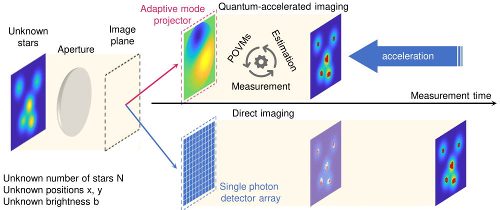
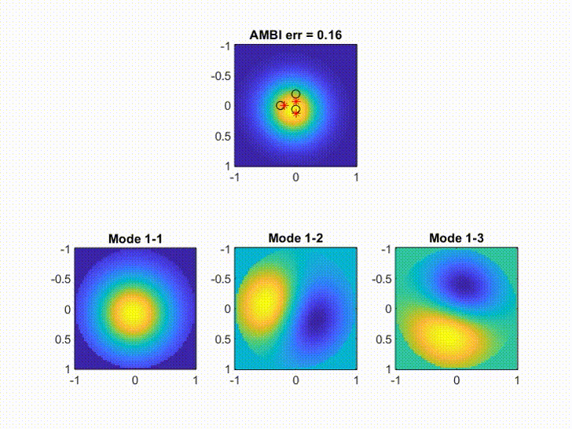
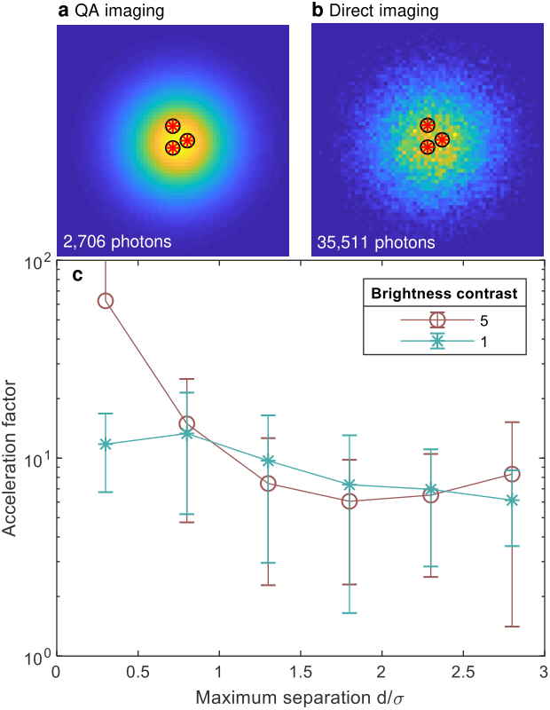

<!DOCTYPE html>
<html lang="en">
<head>
    <meta charset="UTF-8">
    <meta name="viewport" content="width=device-width, initial-scale=1.0">
    <title>Quantum-Accelerated Imaging of N Stars</title>
    
</head>
<body>
    

        

            <h1 class="title">Quantum-Accelerated Imaging of N Stars</h1>
            

                Fanglin Bao1,3, Hyunsoo Choi1, Vaneet Aggarwal2, and Zubin Jacob1,*
            

            

                1Birck Nanotechnology Center, School of Electrical and Computer Engineering, Purdue University 
                2School of Industrial Engineering, and School of Electrical and Computer Engineering, Purdue University 
                3baof@purdue.edu | *Corresponding author: zjacob@purdue.edu
            

            

                <a href="#" class="btn">Paper (PDF)</a>
                <a href="#" class="btn secondary">Code</a>
                <a href="#" class="btn secondary">Supplementary</a>
            

        

        

            <h2>Abstract</h2>
            

                Imaging point sources with low angular separation near or below the Rayleigh criterion are important in astronomy, e.g., in the search for habitable exoplanets near stars. However, the measurement time required to resolve stars in the sub-Rayleigh region via traditional direct imaging is usually prohibitive. Here we propose quantum-accelerated imaging (QAI) to significantly reduce the measurement time using an information-theoretic approach. QAI achieves quantum acceleration by adaptively learning optimal measurements from data to maximize Fisher information per detected photon. Our approach can be implemented experimentally by linear-projection instruments followed by single-photon detectors. We estimate the position, brightness, and the number of unknown stars 10∼100 times faster than direct imaging with the same aperture.
            

        

        

            <h2>Key Results</h2>
            

                

                    
10-100×

                    
Faster than traditional direct imaging

                

                

                    
Sub-Rayleigh

                    
Resolution below diffraction limit

                

                

                    
Adaptive mode measurement

                    
to maximize quantum Fisher information per detected photon

                

            

        

        

            <h2>Method Overview</h2>
            

                
<strong>Quantum-Accelerated Imaging (QAI)</strong> uses adaptive mode projection instead of direct pixel-based imaging. The key innovation is maximizing Fisher information per detected photon through optimal measurement strategies.

                

                    
                    
Figure 1: QAI Schematic vs Direct Imaging (Adaptive Mode Projector → Single-photon Detectors).

                

            

        

        

            <h2>Experimental Results</h2>
            

                
                
Visualization of QAI's iterative scene estimation

            

            

                
                
 Acceleration of QAI — 10-100× speedup across different scenarios

            

        

        

            <h2>Applications</h2>
            <ul style="font-size: 1.1em; line-height: 1.8;">
                <li><strong>Astronomy:</strong> Exoplanet detection, binary star systems</li>
                <li><strong>Microscopy:</strong> High-speed fluorescence imaging</li>
                <li><strong>Quantum Technology:</strong> Single-photon source characterization</li>
                <li><strong>Defense:</strong> Satellite tracking and identification</li>
            </ul>
        

        

            <h2>Citation</h2>
            

@article{bao2021quantum,
  title={Quantum-accelerated imaging of N stars},
  author={Bao, Fanglin and Choi, Hyunsoo and Aggarwal, Vaneet and Jacob, Zubin},
  journal={Optics Letters},
  volume={46},
  number={12},
  pages={2849--2852},
  year={2021},
  publisher={Optical Society of America},
  doi={10.1364/OL.430404}
}
            

        

        

            <h2>Acknowledgments</h2>
            
This work was supported by the Defense Advanced Research Projects Agency. The authors thank Bhargav Ganguly for discussions and S. Guha et al. from the University of Arizona for discussing their unpublished results on the N-star problem.

        

    

</body>
</html>
